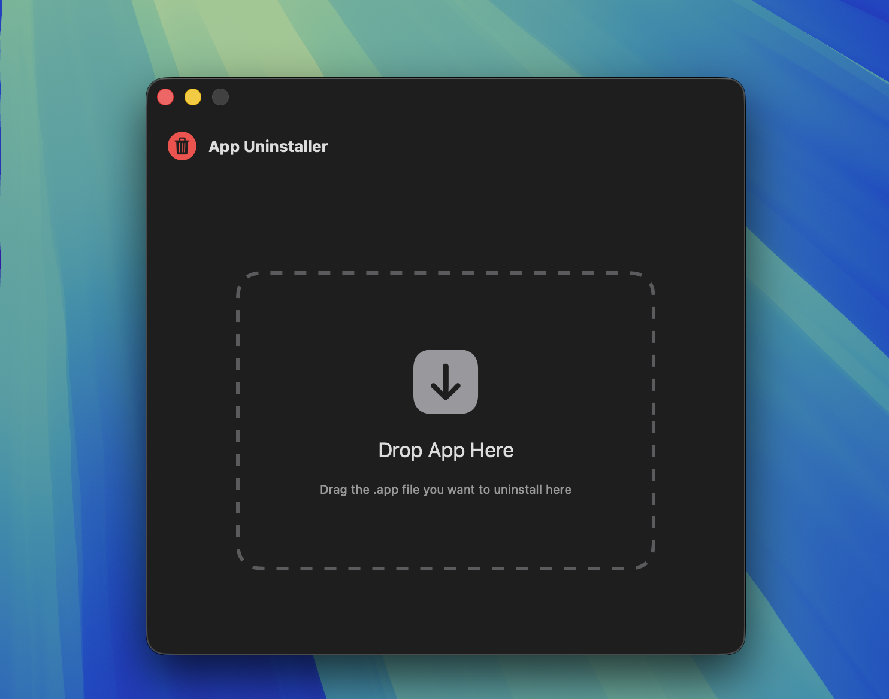
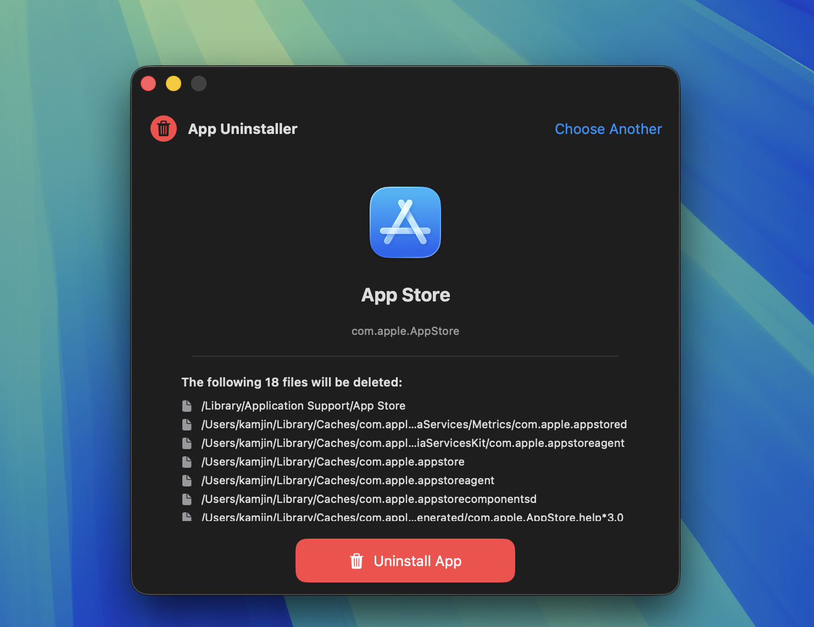

# App Uninstaller

A lightweight, native macOS app uninstaller with drag-and-drop support. Built with Swift and SwiftUI.


## Features

- **Drag & Drop**: Simply drag any `.app` file onto the window to uninstall
- **Deep Cleaning**: Automatically finds and removes related files:
  - Application Support files
  - Preferences (plist files)
  - Caches
  - Logs
  - Saved Application State
  - Containers
  - And more...
- **Native UI**: Beautiful SwiftUI interface that fits right in with macOS
- **Smart Permissions**: Automatically requests admin privileges only when needed
- **Safe**: Shows all files before deletion, requires confirmation

## Screenshots

| Main Interface | Ready to Uninstall |
|:--------------:|:------------------:|
|  |  |

*Drag any .app file to uninstall it along with all related files.*

## Installation

### Download Release

1. Go to [Releases](../../releases)
2. Download `AppUninstaller.zip`
3. Unzip and move `App Uninstaller.app` to `/Applications`
4. On first launch, right-click and select "Open" to bypass Gatekeeper

### Build from Source

Requirements:
- macOS 13.0+
- Xcode Command Line Tools or Xcode

```bash
# Clone the repository
git clone https://github.com/kamjin3086/AppUninstaller.git
cd AppUninstaller

# Build release version
swift build -c release

# Create app bundle (optional)
mkdir -p "AppUninstaller.app/Contents/MacOS"
cp .build/release/AppUninstaller "AppUninstaller.app/Contents/MacOS/"
cp Info.plist "AppUninstaller.app/Contents/"
```

## Usage

1. **Launch** the app
2. **Drag** any `.app` file onto the drop zone
3. **Review** the list of files that will be deleted
4. **Click** "Uninstall" and confirm
5. **Enter** your password if prompted (for system-protected files)

## How It Works

App Uninstaller scans these locations for files related to the app:

| Location | Description |
|----------|-------------|
| `~/Library/Application Support` | App data and settings |
| `~/Library/Preferences` | Preference files (.plist) |
| `~/Library/Caches` | Cached data |
| `~/Library/Logs` | Log files |
| `~/Library/Saved Application State` | Window states |
| `~/Library/HTTPStorages` | HTTP cookies |
| `~/Library/WebKit` | WebKit data |
| `~/Library/Containers` | Sandboxed app data |
| `/Library/Application Support` | System-wide app data |
| `/Library/Preferences` | System-wide preferences |

Files are matched by:
- App name (case-insensitive)
- Bundle identifier (e.g., `com.company.appname`)

## Why Not Mac App Store?

This app requires access to system directories and administrator privileges to fully clean up applications. Mac App Store apps run in a sandbox that prevents this functionality. Similar tools like AppCleaner and CleanMyMac are also distributed outside the App Store for the same reason.

## Contributing

Contributions are welcome! Feel free to:

- Report bugs
- Suggest features
- Submit pull requests

## License

MIT License - see [LICENSE](LICENSE) for details.

## Acknowledgments

Inspired by the need for a simple, open-source alternative to commercial uninstaller apps.
